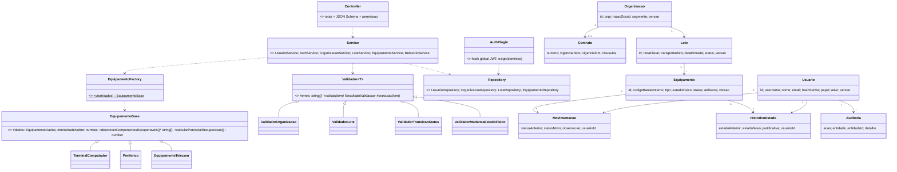

# Diagrama de classes — greencode AV2

```mermaid
classDiagram
    class EquipamentoBase { <<abstract>> #dados: EquipamentoDados; #densidadeNobre: number; +descreverComponentesRecuperaveis()* string[]; +calcularPotencialRecuperacao() number }
    class TerminalComputador
    class Periferico
    class EquipamentoTelecom
    EquipamentoBase <|-- TerminalComputador
    EquipamentoBase <|-- Periferico
    EquipamentoBase <|-- EquipamentoTelecom
    class EquipamentoFactory { <<factory>> +criar(dados)$ EquipamentoBase }
    EquipamentoFactory ..> EquipamentoBase

    class Validador~T~ { <<abstract>> #erros: string[]; +validar(item) ResultadoValidacao; #executar(item)* }
    Validador <|-- ValidadorOrganizacao
    Validador <|-- ValidadorLote
    Validador <|-- ValidadorTransicaoStatus
    Validador <|-- ValidadorMudancaEstadoFisico

    class Controller { <<HTTP>> rotas + JSON Schema + permissao }
    class Service { <<negocio>> UsuarioService; AuthService; OrganizacaoService; LoteService; EquipamentoService; RelatorioService }
    class Repository { <<Prisma>> UsuarioRepository; OrganizacaoRepository; LoteRepository; EquipamentoRepository }
    class AuthPlugin { <<Fastify>> hook global JWT; exigir(dominios) }
    Controller ..> Service
    Service ..> Repository
    Service ..> Validador
    Service ..> EquipamentoFactory
    AuthPlugin ..> Repository

    class Usuario { id; username; nome; email; hashSenha; papel; ativo; versao }
    class Organizacao { id; cnpj; razaoSocial; segmento; versao }
    class Contrato { numero; vigenciaInicio; vigenciaFim; clausulas }
    class Lote { id; notaFiscal; transportadora; dataEntrada; status; versao }
    class Equipamento { id; codigoBarrasInterno; tipo; estadoFisico; status; atributos; versao }
    class Movimentacao { statusAnterior; statusNovo; observacao; usuarioId }
    class HistoricoEstado { estadoAnterior; estadoNovo; justificativa; usuarioId }
    class Auditoria { acao; entidade; entidadeId; detalhe }
    Organizacao "1" --> "0..1" Contrato
    Organizacao "1" --> "*" Lote
    Lote "1" --> "*" Equipamento
    Equipamento "1" --> "*" Movimentacao
    Equipamento "1" --> "*" HistoricoEstado
    Usuario "1" --> "*" Auditoria
    Usuario "1" --> "*" Movimentacao
    Usuario "1" --> "*" HistoricoEstado
```
